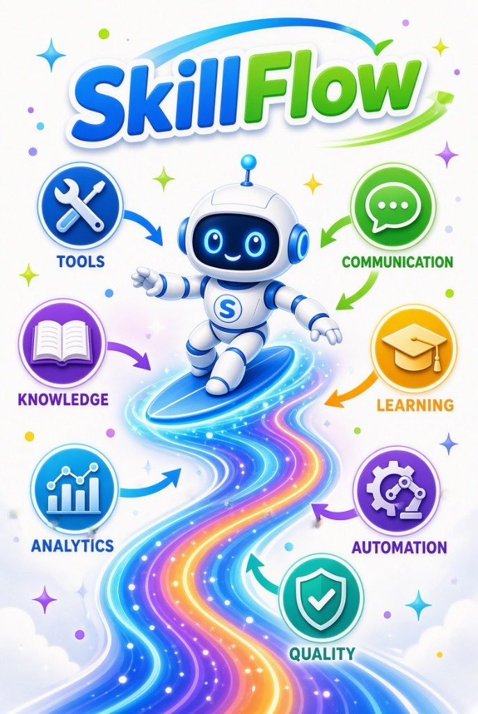

# SkillFlow



Meet **Flo** — SkillFlow's mascot, riding a pipeline of small, reusable skills.

SkillFlow is a minimal "Kubeflow for agents" framework. Skills stay small and stable. Task-specific prompts live outside the skill. Recipes compose skills into linear workflows.

## Development

Requires [uv](https://docs.astral.sh/uv/) and Python 3.12+.

```bash
make sync
make hooks
make lint
make test
```

Equivalent `uv` commands:

```bash
uv sync --group dev
uv run pre-commit install
uv run ruff check .
uv run ruff format .
uv run pytest
```
